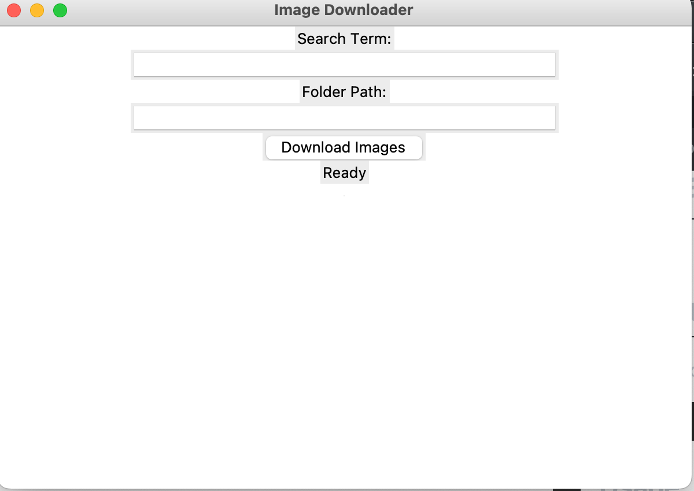

# bookish-octo-waffle

Is an Application for pulling images from a number of websites, this would be useful for moodboards, idea creation and presentations. 

## Prequistes 

The Following Modules are used in this application 

OS module - Which provides the facility to establish the interaction between the user and the operating system. 

Requests Module - Which is used to send HTTP requests using Python and returns a Response Object with all the response data (encoding, content, status, etc)

Tkinter - Which is the Module we will utillise to create the GUI used in this application 

BeautifulSoup - Is the Module that we will use to enable us to perform web scraping it works be parsing HTML and XML documents (including having malformed markup i.e non-closed tags)

PIL - this is the module that will allow us to work with images.

This code was also created with Python 3.8

## Demo 

